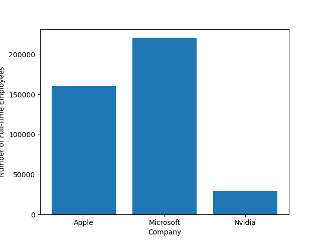

<a target="_blank" href="https://colab.research.google.com/github/cohere-ai/notebooks/blob/main/notebooks/Data_Analyst_Agent_Cohere_and_Langchain.ipynb">
  
</a>

# Tool Use - Simple Data Analyst Agent with Cohere and Langchain

Tool use is a method whichs allows developers to connect Cohere's Command models to external tools like search engines, APIs, databases, and other software tools. Just like how [Retrieval-Augmented Generation (RAG)](https://docs.cohere.com/docs/retrieval-augmented-generation-rag) allows a model to use an external data source to improve factual generation, tool use is a capability that allows retrieving data from multiple sources. But it goes beyond simply retrieving information and is able to use software tools to execute code, or even create entries in a CRM system.

In this notebook, we'll see how we can use two tools to create a simple data analyst agent that is able to search the web and run code in a python interpreter. This agent uses Cohere's Command R+ mode and Langchain.


# Environment
Let's start by installing the required libraries


```python
! pip install --quiet langchain langchain_cohere langchain_experimental
```

         ━━━━━━━━━━━━━━━━━━━━━━━━━━━━━━━━━━━━━━━━ 817.7/817.7 kB 4.8 MB/s eta 0:00:00
         ━━━━━━━━━━━━━━━━━━━━━━━━━━━━━━━━━━━━━━━━ 193.4/193.4 kB 7.4 MB/s eta 0:00:00
         ━━━━━━━━━━━━━━━━━━━━━━━━━━━━━━━━━━━━━━━━ 1.9/1.9 MB 12.3 MB/s eta 0:00:00
         ━━━━━━━━━━━━━━━━━━━━━━━━━━━━━━━━━━━━━━━━ 299.3/299.3 kB 8.4 MB/s eta 0:00:00
         ━━━━━━━━━━━━━━━━━━━━━━━━━━━━━━━━━━━━━━━━ 116.0/116.0 kB 9.0 MB/s eta 0:00:00
         ━━━━━━━━━━━━━━━━━━━━━━━━━━━━━━━━━━━━━━━━ 151.2/151.2 kB 12.5 MB/s eta 0:00:00
         ━━━━━━━━━━━━━━━━━━━━━━━━━━━━━━━━━━━━━━━━ 3.1/3.1 MB 18.2 MB/s eta 0:00:00
         ━━━━━━━━━━━━━━━━━━━━━━━━━━━━━━━━━━━━━━━━ 75.6/75.6 kB 5.0 MB/s eta 0:00:00
         ━━━━━━━━━━━━━━━━━━━━━━━━━━━━━━━━━━━━━━━━ 49.4/49.4 kB 2.8 MB/s eta 0:00:00
         ━━━━━━━━━━━━━━━━━━━━━━━━━━━━━━━━━━━━━━━━ 53.0/53.0 kB 1.9 MB/s eta 0:00:00
         ━━━━━━━━━━━━━━━━━━━━━━━━━━━━━━━━━━━━━━━━ 141.1/141.1 kB 1.4 MB/s eta 0:00:00
         ━━━━━━━━━━━━━━━━━━━━━━━━━━━━━━━━━━━━━━━━ 77.9/77.9 kB 5.4 MB/s eta 0:00:00
         ━━━━━━━━━━━━━━━━━━━━━━━━━━━━━━━━━━━━━━━━ 58.3/58.3 kB 4.4 MB/s eta 0:00:00
    [?25h

## Setup
We'll need a Cohere API key here. Grab your key and paste it in the next slide if you have one, or [register](https://dashboard.cohere.ai/welcome/register) and create a new API key.


```python
### LLMs
import os
os.environ['COHERE_API_KEY'] = <sfef>
```


```python
# Create the Cohere chat model
from langchain_cohere.chat_models import ChatCohere
chat = ChatCohere(model="command-r-plus", temperature=0.3)
```

# Define tools
Our simple data analyst will be equipped with a web search tool, and a python interpreter (which we can use to run plotting code, for example).

### Web search
Let's first equip our agent with web search! We can use the Tivaly API for this. Head on to [tavily.com](https://tavily.com) and grab an API key to use here.


```python
from langchain_community.tools.tavily_search import TavilySearchResults

os.environ['TAVILY_API_KEY'] = "<>

internet_search = TavilySearchResults()
internet_search.name = "internet_search"
internet_search.description = "Returns a list of relevant document snippets for a textual query retrieved from the internet."


from langchain_core.pydantic_v1 import BaseModel, Field
class TavilySearchInput(BaseModel):
    query: str = Field(description="Query to search the internet with")
internet_search.args_schema = TavilySearchInput
```

### Python interpreter tool
Let's equip our agent with a python interpreter!


```python
from langchain.agents import Tool
from langchain_experimental.utilities import PythonREPL

python_repl = PythonREPL()
repl_tool = Tool(
    name="python_repl",
    description="Executes python code and returns the result. The code runs in a static sandbox without interactive mode, so print output or save output to a file.",
    func=python_repl.run,
)
repl_tool.name = "python_interpreter"

# from langchain_core.pydantic_v1 import BaseModel, Field
class ToolInput(BaseModel):
    code: str = Field(description="Python code to execute.")
repl_tool.args_schema = ToolInput

```


```python

```

# Create ReAct Agent: the data analyst


```python
from langchain.agents import AgentExecutor
from langchain_cohere.react_multi_hop.agent import create_cohere_react_agent
from langchain_core.prompts import ChatPromptTemplate
```


```python
# Create the prompt
prompt = ChatPromptTemplate.from_template("{input}")


# Create the ReAct agent
agent = create_cohere_react_agent(
    llm=chat,
    tools=[internet_search, repl_tool],
    prompt=prompt,
)
```


```python
agent_executor = AgentExecutor(agent=agent, tools=[internet_search, repl_tool], verbose=True)
```

# Let's ask a question to the data analyst


```python
agent_executor.invoke({
    "input": "Create a plot of the number of full time employees at the 3 tech companies with the highest market cap in the United States in 2024.",
})
```

    
    
    > Entering new AgentExecutor chain...
    
    First, I will search for the 3 tech companies with the highest market cap in the United States in 2024. Then, I will search for the number of full-time employees at each of these companies. Finally, I will use Python to create a plot of the number of full-time employees at these companies.
    {'tool_name': 'internet_search', 'parameters': {'query': '3 tech companies with highest market cap in the United States 2024'}}
    [{'url': 'https://simplywall.st/stocks/us/tech/market-cap-large', 'content': 'United States / Largest U.S. Tech Stocks by Market Cap. UPDATED Apr 25, 2024. Discover large cap U.S. Tech companies that are on the NYSE and NASDAQ. These Tech Companies are organised by Market Cap. 🇺🇸 US Market Tech. Advanced Filters. Market Cap High to Low. 208 companies ...'}, {'url': 'https://www.statista.com/statistics/1350976/leading-tech-companies-worldwide-by-market-cap/', 'content': 'Digital & Trend reports\nOverview and forecasts on trending topics\nIndustry & Market reports\nIndustry and market insights and forecasts\nCompanies & Products reports\nKey figures and rankings about companies and products\nConsumer & Brand reports\nConsumer and brand insights and preferences in various industries\nPolitics & Society reports\nDetailed information about political and social topics\nCountry & Region reports\nAll key figures about countries and regions\nMarket forecast and expert KPIs for 1000+ markets in 190+ countries & territories\nInsights on consumer attitudes and behavior worldwide\nBusiness information on 100m+ public and private companies\nExplore Company Insights\nDetailed information for 39,000+ online stores and marketplaces\nDirectly accessible data for 170 industries from 150+ countries\nand over 1\xa0Mio. facts.\n Other statistics on the topicAI chips\nHardware\nLeading semiconductor companies worldwide 2023, by market cap\nHardware\nSemiconductor market revenue growth worldwide 1988-2024\nHardware\nNvidia revenue worldwide 2015-2023, by segment\nHardware\nSemiconductor market size worldwide 2020-2030, by application\nYou only have access to basic statistics.\n Other statistics that may interest you\nOther statistics that may interest you Statistics on\nAbout the industry\nAbout the region\nOther regions\nRelated statistics\nFurther related statistics\nFurther Content: You might find this interesting as well\nStatistics\nTopics Transforming data into design:\nStatista Content & Design\nStrategy and business building for the data-driven economy:\nLeading tech companies worldwide 2023, by market cap\nApple\nSamsung\nLeading tech companies worldwide 2023, by market capitalization\n(in billion U.S. dollars)\n Additional Information\nShow sources information\nShow publisher information\nUse Ask Statista Research Service\nAugust 2023\nWorldwide\n2023\n'}, {'url': 'https://www.fool.com/research/largest-companies-by-market-cap/', 'content': "It's the most valuable automaker in the world and has the world's best-selling car in the Model Y.\nTesla is most famous for its vehicles, and it's second only to China's BYD Company (OTC:BYDDY) among the largest EV companies in terms of manufacturing. While it's most famous for Windows, Microsoft also has a diverse selection of products and services that has helped to build on its success, including:\nMicrosoft has been the world's largest company before, and it briefly surpassed Apple for the biggest market cap in 2021. Walmart\nWalmart (NYSE:WMT) may not have the largest market cap, but it is No. 1 in terms of revenue, and it’s the largest retailer in the world. Microsoft\nConsidering the popularity of the Windows operating system, it’s no surprise that Microsoft (NASDAQ:MSFT) has consistently ranked as one of the largest companies in the world. Although the top spot has changed hands on multiple occasions, Apple has spent the most time there and is currently the most valuable company in the world.\n"}, {'url': 'https://ceoworld.biz/2024/02/17/the-united-states-largest-companies-by-market-capitalization-2024/', 'content': 'Christina Miller\nUP NEXT\n20 Biggest Gold Companies in Australia, 2024\nWestern Bulk Chartering AS Appoints Ørjan Svanevik as Interim CEO\nVolvo Trucks UK & Ireland Welcomes New Financial Leadership\nPrometheum Appoints Wall Street Veteran Albert Meo as CFO\nNikola Welcomes Thomas Okray as CFO\nLet’s stay in touch\nCompany Info\nFind us on socials\nWho we are?\n This list comprises the biggest companies currently in the United States by market cap in 2024:\nThe United States Largest Companies by market capitalization, 2024\nMarket capitalization, commonly known as market cap, refers to the total market value of a company’s outstanding shares. Overall, among the United States’ top 10 largest companies by market capitalization, the sixth, seventh, eighth, ninth, and tenth positions are held by Meta Platforms, Berkshire Hathaway, Eli Lilly And Company, Tesla, and Broadcom Inc.\nWhich one is the most valuable in the United States by market cap? The United States’ Largest Companies by market capitalization, 2024\nAs of March 3, 2024, Microsoft is the most valuable company in the United States, with a market cap of $3074 billion. Stocks are often categorized by market cap: mega-cap ($100 billion-plus), large-cap ($10 billion-$100 billion), mid-cap ($2 billion-$10 billion), small-cap ($300 million-$2 billion), and micro-cap (less than $300 million).\n'}, {'url': 'https://disfold.com/united-states/sector/technology/companies/', 'content': 'Unlock Financial AI:\nStart your Free Trial of\nDisfold AI, Now!\nTop Technology Companies from the United States as of Jan. 01, 2024\n(Dec. 1, 2023)\nTop Technology Companies from the United States as of Jan. 01, 2024\n1.\nApple\nMarket Cap (USD):\n$2.866 T\nStock:\nAAPL\nwb_incandescent\nCountry:\nUnited States\nSector:\nTechnology\nIndustry:\nConsumer Electronics\n2.\nMicrosoft\nMarket Cap (USD):\n$2.755 T\nStock:\nMSFT\nwb_incandescent\nCountry:\nUnited States\nSector:\nTechnology\nIndustry:\nSoftware—Infrastructure\n3.\nNvidia\nMarket Cap (USD):\n$1.186 T\nStock:\nNVDA\nwb_incandescent\nCountry:\nUnited States\nSector:\nTechnology\nIndustry:\nSemiconductors\n4.\nBroadcom\nMarket Cap (USD):\n$495.95 B\nStock:\nAVGO\nwb_incandescent\nCountry:\nUnited States\nSector:\nTechnology\nIndustry:\nSemiconductors\n5.\nOracle\nMarket Cap (USD):\n$282.01 B\nStock:\nORCL\nwb_incandescent\nCountry:\nUnited States\nSector:\nTechnology\nIndustry:\nSoftware—Infrastructure\n6.\n Marvell Technology, Inc.\nMarket Cap (USD):\n$49.61 B\nStock:\n9MW\nwb_incandescent\nCountry:\nUnited States\nSector:\nTechnology\nIndustry:\nSemiconductors\n35.\nAutodesk, Inc.\nMarket Cap (USD):\n$48.97 B\nStock:\nADSK\nwb_incandescent\nCountry:\nUnited States\nSector:\nTechnology\nIndustry:\nSoftware—Application\n36.\nMicrochip Technology Incorporated\nMarket Cap (USD):\n$45.77 B\nStock:\nMCHP\nwb_incandescent\nCountry:\nUnited States\nSector:\nTechnology\nIndustry:\nSemiconductors\n37.\nFortinet, Inc.\nMarket Cap (USD):\n$44.84 B\nStock:\n Analog Devices\nMarket Cap (USD):\n$93.79 B\nStock:\nADI\nwb_incandescent\nCountry:\nUnited States\nSector:\nTechnology\nIndustry:\nSemiconductors\n20.\nMicron Technology, Inc.\nMarket Cap (USD):\n$91.30 B\nStock:\nMU\nwb_incandescent\nCountry:\nUnited States\nSector:\nTechnology\nIndustry:\nSemiconductors\n21.\nPalo Alto Networks\nMarket Cap (USD):\n$90.41 B\nStock:\nPANW\nwb_incandescent\nCountry:\nUnited States\nSector:\nTechnology\nIndustry:\nSoftware—Infrastructure\n22.\n Fiserv\nMarket Cap (USD):\n$79.73 B\nStock:\nFI\nwb_incandescent\nCountry:\nUnited States\nSector:\nTechnology\nIndustry:\nInformation Technology Services\n23.\nKLA\nMarket Cap (USD):\n$75.13 B\nStock:\nKLAC\nwb_incandescent\nCountry:\nUnited States\nSector:\nTechnology\nIndustry:\nSemiconductor Equipment & Materials\n24.\nSynopsys\nMarket Cap (USD):\n$74.64 B\nStock:\nSNPS\nwb_incandescent\nCountry:\nUnited States\nSector:\nTechnology\nIndustry:\nSoftware—Infrastructure\n25.\n Salesforce\nMarket Cap (USD):\n$243.78 B\nStock:\nCRM\nwb_incandescent\nCountry:\nUnited States\nSector:\nTechnology\nIndustry:\nSoftware—Application\n8.\nAMD\nMarket Cap (USD):\n$219.72 B\nStock:\nAMD\nwb_incandescent\nCountry:\nUnited States\nSector:\nTechnology\nIndustry:\nSemiconductors\n9.\nCisco\nMarket Cap (USD):\n$205.21 B\nStock:\nCSCO\nwb_incandescent\nCountry:\nUnited States\nSector:\nTechnology\nIndustry:\nCommunication Equipment\n10.\n'}]
    I found that the 3 tech companies with the highest market cap in the United States in 2024 are Apple, Microsoft, and Nvidia. Now, I will search for the number of full-time employees at each of these companies.
    {'tool_name': 'internet_search', 'parameters': {'query': 'number of full time employees at apple 2024'}}
    [{'url': 'https://www.globaldata.com/data-insights/technology-media-and-telecom/apples-Number-of-employees/', 'content': 'Related Data & Insights\nRelated Companies\nUnited States of America\nUnited States of America\nUnited States of America\nSouth Korea\nTaiwan\nUnited States of America\nUnited States of America\nUnited States of America\nUnited States of America\nJapan\nDon’t wait - discover a universe of connected data & insights with your next search. Data & Insights\nInsight by Sector\nInsight Type\nThemes\nKey Themes\nESG Factors\nSearch our premium data\nApple’s Number of Employees (FY2017 – FY2022)\n Apple sells and distributes digital content and applications through the Apple Store, App Store, Apple Arcade, Apple News+, Apple Fitness+, Apple Card, Apple Pay, and Apple Music. Number of Employees: Apple\nApple is an American multinational company that produces desktop computers, laptops, tablets, smartphones, computer accessories, and software headquartered in Cupertino, California, United States. Access more premium companies when you subscribe to Explorer\nGet in touch about GlobalData Company reports\nContact the team or request a demo to find out how our data can drive your business forward'}, {'url': 'https://www.apple.com/newsroom/2024/02/apple-reports-first-quarter-results/', 'content': 'The latest news and updates,\ndirect from Apple.\nRead more\nApple Footer\nShop and Learn\nShop and Learn\n+\nApple Wallet\nApple Wallet\n+\nAccount\nAccount\n+\nEntertainment\nEntertainment\n+\nApple Store\nApple Store\n+\nFor Business\nFor Business\n+\nFor Education\nFor Education\n+\nFor Healthcare\nFor Healthcare\n+\nFor Government\nFor Government\n+\nApple Values\nApple Values\n+\nAbout Apple\nAbout Apple\n+ Risks and uncertainties include without limitation: effects of global and regional economic conditions, including as a result of government policies, war, terrorism, natural disasters, and public health issues; risks relating to the design, manufacture, introduction, and transition of products and services in highly competitive and rapidly changing markets, including from reliance on third parties for components, technology, manufacturing, applications, and content; risks relating to information technology system failures, network disruptions, and failure to protect, loss of, or unauthorized access to, or release of, data; and effects of unfavorable legal proceedings, government investigations, and complex and changing laws and regulations. Press Contact\nJosh Rosenstock\nApple\njrosenstock@apple.com\n(408) 862-1142\nInvestor Relations Contact\nSuhasini Chandramouli\nApple\nsuhasini@apple.com\n(408) 974-3123\n More information on these risks and other potential factors that could affect the Company’s business, reputation, results of operations, financial condition, and stock price is included in the Company’s filings with the SEC, including in the “Risk Factors” and “Management’s Discussion and Analysis of Financial Condition and Results of Operations” sections of the Company’s most recently filed periodic reports on Form 10-K and Form 10-Q and subsequent filings. Apple’s five software platforms — iOS, iPadOS, macOS, watchOS, and tvOS — provide seamless experiences across all Apple devices and empower people with breakthrough services including the App Store, Apple Music, Apple Pay, and iCloud.'}, {'url': 'https://stockanalysis.com/stocks/aapl/employees/', 'content': 'Apple had 161,000 employees on September 30, 2023. The number of employees decreased by 3,000 or -1.83% compared to the previous year. Employees 161,000. Change (1Y) -3,000. Growth (1Y) -1.83%. Revenue / Employee ... Real-time quotes provided by IEX Cloud. Other market data may be delayed by 15 minutes or more.'}, {'url': 'https://www.statista.com/statistics/273439/number-of-employees-of-apple-since-2005/', 'content': 'Digital & Trend reports\nOverview and forecasts on trending topics\nIndustry & Market reports\nIndustry and market insights and forecasts\nCompanies & Products reports\nKey figures and rankings about companies and products\nConsumer & Brand reports\nConsumer and brand insights and preferences in various industries\nPolitics & Society reports\nDetailed information about political and social topics\nCountry & Region reports\nAll key figures about countries and regions\nMarket forecast and expert KPIs for 1000+ markets in 190+ countries & territories\nInsights on consumer attitudes and behavior worldwide\nBusiness information on 100m+ public and private companies\nExplore Company Insights\nDetailed information for 39,000+ online stores and marketplaces\nDirectly accessible data for 170 industries from 150+ countries\nand over 1\xa0Mio. facts.\n Other statistics on the topicApple\nConsumer Electronics\nApple\'s revenue worldwide 2004-2023\nConsumer Electronics\nApple\'s revenue broken down by geographical region 2012-2023, by quarter\nTelecommunications\nQuarterly market share of smartphone vendors in the U.S. 2016-2023\nConsumer Electronics\nApple: expenditure on research and development 2007-2023\nTo download this statistic in XLS format you need a Statista Account\nTo download this statistic in PNG format you need a Statista Account\nTo download this statistic in PDF format you need a Statista Account\nTo download this statistic in PPT format you need a Statista Account\nAs a Premium user you get access to the detailed source references and background information about this statistic.\n Statistics on\n"\nApple in the U.S.\n"\nOther statistics that may interest you Apple in the U.S.\nOverview: Apple\nOverview: Apple in the U.S.\nSegment: iPhone\nSegment: iPad\nSegment: Mac\nSegment: Wearables & Smart home\nFurther related statistics\nFurther Content: You might find this interesting as well\nStatistics\nTopics Number of employees of Apple 2005-2023\nApple Corporation – additional information\nApple products\nApple\'s number of employees in the fiscal years 2005 to 2023\n(in 1,000s)\nAdditional Information\nShow sources information\nShow publisher information\nUse Ask Statista Research Service\nNovember 2023\nWorldwide\n2005 to 2023\n Transforming data into design:\nStatista Content & Design\nStrategy and business building for the data-driven economy:\nIndustry-specific and extensively researched technical data (partially from exclusive partnerships).'}, {'url': 'https://www.macrotrends.net/stocks/charts/AAPL/apple/number-of-employees', 'content': 'Employee Count. Interactive chart of Apple (AAPL) annual worldwide employee count from 2010 to 2023. Apple total number of employees in 2023 was 161,000, a 1.83% decline from 2022. Apple total number of employees in 2022 was 164,000, a 6.49% increase from 2021. Apple total number of employees in 2021 was 154,000, a 4.76% increase from 2020.'}]
    {'tool_name': 'internet_search', 'parameters': {'query': 'number of full time employees at microsoft 2024'}}
    [{'url': 'https://www.macrotrends.net/stocks/charts/MSFT/microsoft/number-of-employees', 'content': 'Interactive chart of Microsoft (MSFT) annual worldwide employee count from 2010 to 2023. Microsoft total number of employees in 2023 was 221,000, a 0% decline from 2022. Microsoft total number of employees in 2022 was 221,000, a 22.1% increase from 2021. Microsoft total number of employees in 2021 was 181,000, a 11.04% increase from 2020.'}, {'url': 'https://finance.yahoo.com/quote/MSFT/profile/', 'content': 'Additionally, this segment provides gaming, which includes Xbox hardware and content, and first- and third-party content; Xbox game pass and other subscriptions, cloud gaming, advertising, third-party disc royalties, and other cloud services; and search and news advertising, which includes Bing, Microsoft News and Edge, and third-party affiliates. The Intelligent Cloud segment offers server products and cloud services, such as azure and other cloud services; SQL and windows server, visual studio, system center, and related client access licenses, as well as nuance and GitHub; and enterprise services including enterprise support services, industry solutions, and nuance professional services. The More Personal Computing segment offers Windows, including windows OEM licensing and other non-volume licensing of the Windows operating system; Windows commercial comprising volume licensing of the Windows operating system, windows cloud services, and other Windows commercial offerings; patent licensing; and windows Internet of Things; and devices, such as surface, HoloLens, and PC accessories. The Productivity and Business Processes segment offers office, exchange, SharePoint, Microsoft Teams, office 365 Security and Compliance, Microsoft viva, and Microsoft 365 copilot; and office consumer services, such as Microsoft 365 consumer subscriptions, Office licensed on-premises, and other office services. Microsoft Corporation (MSFT)\nMicrosoft Corporation\nOne Microsoft WayRedmond, WA 98052-6399United States425 882 8080https://www.microsoft.com\nSector(s):\xa0TechnologyIndustry:\xa0Software - InfrastructureFull Time Employees:\xa0221,000\nKey Executives\nDescription\nMicrosoft Corporation develops and supports software, services, devices and solutions worldwide.'}, {'url': 'https://www.statista.com/statistics/273475/number-of-employees-at-the-microsoft-corporation-since-2005/', 'content': 'Digital & Trend reports\nOverview and forecasts on trending topics\nIndustry & Market reports\nIndustry and market insights and forecasts\nCompanies & Products reports\nKey figures and rankings about companies and products\nConsumer & Brand reports\nConsumer and brand insights and preferences in various industries\nPolitics & Society reports\nDetailed information about political and social topics\nCountry & Region reports\nAll key figures about countries and regions\nMarket forecast and expert KPIs for 1000+ markets in 190+ countries & territories\nInsights on consumer attitudes and behavior worldwide\nBusiness information on 100m+ public and private companies\nExplore Company Insights\nDetailed information for 39,000+ online stores and marketplaces\nDirectly accessible data for 170 industries from 150+ countries\nand over 1\xa0Mio. facts.\n Other statistics on the topicMicrosoft\nSoftware\nMicrosoft\'s expenditure on research and development 2002-2023\nSoftware\nOffice productivity software market share worldwide 2022\nIT Services\nCloud infrastructure services market share quarterly worldwide 2017-2022, by vendor\nSoftware\nMicrosoft\'s revenue 2008-2024, by fiscal quarter\nTo download this statistic in XLS format you need a Statista Account\nTo download this statistic in PNG format you need a Statista Account\nTo download this statistic in PDF format you need a Statista Account\nTo download this statistic in PPT format you need a Statista Account\nAs a Premium user you get access to the detailed source references and background information about this statistic.\n Statistics on\n"\nMicrosoft\n"\nOther statistics that may interest you Microsoft\nOverview\nCompany financials\nSegments\nCompetitors: Software\nCompetitors: Cloud\nCompetitors: Devices\nFurther related statistics\nFurther Content: You might find this interesting as well\nStatistics\nTopics Number of Microsoft employees 2005-2023\nHow many employees does Microsoft have?\nNumber of employees at the Microsoft Corporation from 2005 to 2023\n(in 1,000s)\nAdditional Information\nShow sources information\nShow publisher information\nUse Ask Statista Research Service\nJuly 2023\nWorldwide\n2005 to 2023\nMicrosoft\'s fiscal year ends on June 30.\n Transforming data into design:\nStatista Content & Design\nStrategy and business building for the data-driven economy:\nIndustry-specific and extensively researched technical data (partially from exclusive partnerships).'}, {'url': 'https://stockanalysis.com/stocks/msft/employees/', 'content': 'Microsoft had 221,000 employees on June 30, 2023. The number of employees did not change compared to the previous year. Employees 221,000. Change (1Y) n/a. Growth (1Y) n/a. Revenue / Employee $1,070,516. Profits / Employee ... Real-time quotes provided by IEX Cloud. Other market data may be delayed by 15 minutes or more.'}, {'url': 'https://www.microsoft.com/investor/reports/ar23/index.html', 'content': 'As of June 30, 2023, we employed approximately 221,000 people on a full-time basis, 120,000 in the U.S. and 101,000 internationally. Of the total employed people, 89,000 were in operations, including manufacturing, distribution, product support, and consulting services; 72,000 were in product research and development; 45,000 were in sales and ...'}]
    {'tool_name': 'internet_search', 'parameters': {'query': 'number of full time employees at nvidia 2024'}}
    [{'url': 'https://www.statista.com/statistics/1369575/nvidia-number-of-employees-by-region/', 'content': 'Digital & Trend reports\nOverview and forecasts on trending topics\nIndustry & Market reports\nIndustry and market insights and forecasts\nCompanies & Products reports\nKey figures and rankings about companies and products\nConsumer & Brand reports\nConsumer and brand insights and preferences in various industries\nPolitics & Society reports\nDetailed information about political and social topics\nCountry & Region reports\nAll key figures about countries and regions\nMarket forecast and expert KPIs for 1000+ markets in 190+ countries & territories\nInsights on consumer attitudes and behavior worldwide\nBusiness information on 100m+ public and private companies\nExplore Company Insights\nDetailed information for 39,000+ online stores and marketplaces\nDirectly accessible data for 170 industries from 150+ countries\nand over 1\xa0Mio. facts.\n Other statistics on the topicNvidia\nHardware\nSemiconductor market revenue worldwide 1987-2024\nHardware\nLeading semiconductor companies worldwide 2024, by market cap\nHardware\nSemiconductor companies market revenue share worldwide 2008-2023\nHardware\nSemiconductor market revenue growth worldwide 1988-2024\nTo download this statistic in XLS format you need a Statista Account\nTo download this statistic in PNG format you need a Statista Account\nTo download this statistic in PDF format you need a Statista Account\nTo download this statistic in PPT format you need a Statista Account\nAs a Premium user you get access to the detailed source references and background information about this statistic.\n Nvidia number of employees 2023, by region\nNvidia number of employees in 2023, by region\nAdditional Information\nShow sources information\nShow publisher information\nUse Ask Statista Research Service\nJuly 2023\nWorldwide\n2023\nIncludes full-time and part-time employees.\n Statistics on\n"\nNvidia\n"\nOther statistics that may interest you Nvidia\nOverview\nFinancials\nSegments\nESG\nCompetitors\nFurther Content: You might find this interesting as well\nTopics Transforming data into design:\nStatista Content & Design\nStrategy and business building for the data-driven economy:\nIndustry-specific and extensively researched technical data (partially from exclusive partnerships).'}, {'url': 'https://stocklight.com/stocks/us/nasdaq-nvda/nvidia/annual-reports/nasdaq-nvda-2024-10K-24660316.pdf', 'content': "The number of shares of common stock outstanding as of February 16, 2024 was 2.5 billion. DOCUMENTS INCORPORATED BY REFERENCE Portions of the registrant's Proxy Statement for its 2024 Annual Meeting of Shareholders to be filed with the Securities and Exchange Commission pursuant to Regulation 14A not later than 120 days after the end of the"}, {'url': 'https://stockanalysis.com/stocks/nvda/employees/', 'content': 'NVIDIA had 29,600 employees on January 28, 2024. The number of employees increased by 3,404 or 12.99% compared to the previous year. Employees 29,600. Change (1Y) 3,404. ... Real-time quotes provided by IEX Cloud. Other market data may be delayed by 15 minutes or more. ...'}, {'url': 'https://www.macrotrends.net/stocks/charts/NVDA/nvidia/number-of-employees', 'content': 'Employee Count. Interactive chart of NVIDIA (NVDA) annual worldwide employee count from 2010 to 2024. NVIDIA total number of employees in 2024 was 29,600, a 12.99% increase from 2023. NVIDIA total number of employees in 2023 was 26,196, a 16.57% increase from 2022. NVIDIA total number of employees in 2022 was 22,473, a 18.43% increase from 2021.'}, {'url': 'https://investor.nvidia.com/news/press-release-details/2024/NVIDIA-Announces-Financial-Results-for-Fourth-Quarter-and-Fiscal-2024/?ref=robotradingnet.ghost.io', 'content': 'SANTA CLARA, Calif., Feb. 21, 2024 (GLOBE NEWSWIRE) -- NVIDIA (NASDAQ: NVDA) today reported revenue for the fourth quarter ended January 28, 2024, of $22.1 billion, up 22% from the previous quarter and up 265% from a year ago. For the quarter, GAAP earnings per diluted share was $4.93, up 33% from the previous quarter and up 765% from a year ...'}]

    WARNING:langchain_experimental.utilities.python:Python REPL can execute arbitrary code. Use with caution.
    

    
    I found that the number of full-time employees at Apple, Microsoft, and Nvidia as of 2023 are 161,000, 221,000, and 29,600, respectively. Now, I will use Python to create a plot of the number of full-time employees at these companies.
    {'tool_name': 'python_interpreter', 'parameters': {'code': 'import matplotlib.pyplot as plt\n\n# Number of full-time employees at the 3 tech companies\nnum_employees = [161000, 221000, 29600]\ncompanies = ["Apple", "Microsoft", "Nvidia"]\n\n# Create a bar plot\nplt.bar(companies, num_employees)\n\n# Add labels and title\nplt.xlabel("Company")\nplt.ylabel("Number of Full-Time Employees")\nplt.title("Number of Full-Time Employees at the Top 3 Tech Companies in the US")\n\n# Save the plot\nplt.savefig("number_of_full_time_employees.png")'}}
    Relevant Documents: 2,3,4,7,9,10,11,13,14,17,18,20
    Cited Documents: 2,3,4,7,9,10,11,13,14,17,18,20
    Answer: Here is a plot showing the number of full-time employees at the 3 tech companies with the highest market cap in the United States in 2024:
    
    
    
    The number of full-time employees at Apple, Microsoft, and Nvidia as of 2023 are 161,000, 221,000, and 29,600, respectively.
    Grounded answer: Here is a plot showing the number of full-time employees at the 3 tech companies with the highest market cap in the United States in 2024:
    
    <co: 20>! [Number of Full-Time Employees](number_of_full_time_employees.png)</co: 20>
    
    The number of full-time employees at <co: 2,4,7,9>Apple</co: 2,4,7,9>, <co: 2,3,4,10,11,13,14>Microsoft</co: 2,3,4,10,11,13,14>, and <co: 4,17,18>Nvidia</co: 4,17,18> as of <co: 7,9,10,13,17,18>2023</co: 7,9,10,13,17,18> are <co: 7,9>161,000</co: 7,9>, <co: 10,11,13,14>221,000</co: 10,11,13,14>, and <co: 17,18>29,600</co: 17,18>, respectively.
    
    > Finished chain.
    


    {'input': 'Create a plot of the number of full time employees at the 3 tech companies with the highest market cap in the United States in 2024.',
     'output': 'Here is a plot showing the number of full-time employees at the 3 tech companies with the highest market cap in the United States in 2024:\n\n! [Number of Full-Time Employees](number_of_full_time_employees.png)\n\nThe number of full-time employees at Apple, Microsoft, and Nvidia as of 2023 are 161,000, 221,000, and 29,600, respectively.',
     'citations': [CohereCitation(start=140, end=208, text='! [Number of Full-Time Employees](number_of_full_time_employees.png)', documents=[{'output': '', 'id': 'doc_20'}], document_ids={'doc_20'}),
      CohereCitation(start=247, end=252, text='Apple', documents=[{'url': 'https://www.macrotrends.net/stocks/charts/AAPL/apple/number-of-employees', 'content': 'Employee Count. Interactive chart of Apple (AAPL) annual worldwide employee count from 2010 to 2023. Apple total number of employees in 2023 was 161,000, a 1.83% decline from 2022. Apple total number of employees in 2022 was 164,000, a 6.49% increase from 2021. Apple total number of employees in 2021 was 154,000, a 4.76% increase from 2020.', 'id': 'doc_9'}, {'url': 'https://www.fool.com/research/largest-companies-by-market-cap/', 'content': "It's the most valuable automaker in the world and has the world's best-selling car in the Model Y.\nTesla is most famous for its vehicles, and it's second only to China's BYD Company (OTC:BYDDY) among the largest EV companies in terms of manufacturing. While it's most famous for Windows, Microsoft also has a diverse selection of products and services that has helped to build on its success, including:\nMicrosoft has been the world's largest company before, and it briefly surpassed Apple for the biggest market cap in 2021. Walmart\nWalmart (NYSE:WMT) may not have the largest market cap, but it is No. 1 in terms of revenue, and it’s the largest retailer in the world. Microsoft\nConsidering the popularity of the Windows operating system, it’s no surprise that Microsoft (NASDAQ:MSFT) has consistently ranked as one of the largest companies in the world. Although the top spot has changed hands on multiple occasions, Apple has spent the most time there and is currently the most valuable company in the world.\n", 'id': 'doc_2'}, {'url': 'https://disfold.com/united-states/sector/technology/companies/', 'content': 'Unlock Financial AI:\nStart your Free Trial of\nDisfold AI, Now!\nTop Technology Companies from the United States as of Jan. 01, 2024\n(Dec. 1, 2023)\nTop Technology Companies from the United States as of Jan. 01, 2024\n1.\nApple\nMarket Cap (USD):\n$2.866 T\nStock:\nAAPL\nwb_incandescent\nCountry:\nUnited States\nSector:\nTechnology\nIndustry:\nConsumer Electronics\n2.\nMicrosoft\nMarket Cap (USD):\n$2.755 T\nStock:\nMSFT\nwb_incandescent\nCountry:\nUnited States\nSector:\nTechnology\nIndustry:\nSoftware—Infrastructure\n3.\nNvidia\nMarket Cap (USD):\n$1.186 T\nStock:\nNVDA\nwb_incandescent\nCountry:\nUnited States\nSector:\nTechnology\nIndustry:\nSemiconductors\n4.\nBroadcom\nMarket Cap (USD):\n$495.95 B\nStock:\nAVGO\nwb_incandescent\nCountry:\nUnited States\nSector:\nTechnology\nIndustry:\nSemiconductors\n5.\nOracle\nMarket Cap (USD):\n$282.01 B\nStock:\nORCL\nwb_incandescent\nCountry:\nUnited States\nSector:\nTechnology\nIndustry:\nSoftware—Infrastructure\n6.\n Marvell Technology, Inc.\nMarket Cap (USD):\n$49.61 B\nStock:\n9MW\nwb_incandescent\nCountry:\nUnited States\nSector:\nTechnology\nIndustry:\nSemiconductors\n35.\nAutodesk, Inc.\nMarket Cap (USD):\n$48.97 B\nStock:\nADSK\nwb_incandescent\nCountry:\nUnited States\nSector:\nTechnology\nIndustry:\nSoftware—Application\n36.\nMicrochip Technology Incorporated\nMarket Cap (USD):\n$45.77 B\nStock:\nMCHP\nwb_incandescent\nCountry:\nUnited States\nSector:\nTechnology\nIndustry:\nSemiconductors\n37.\nFortinet, Inc.\nMarket Cap (USD):\n$44.84 B\nStock:\n Analog Devices\nMarket Cap (USD):\n$93.79 B\nStock:\nADI\nwb_incandescent\nCountry:\nUnited States\nSector:\nTechnology\nIndustry:\nSemiconductors\n20.\nMicron Technology, Inc.\nMarket Cap (USD):\n$91.30 B\nStock:\nMU\nwb_incandescent\nCountry:\nUnited States\nSector:\nTechnology\nIndustry:\nSemiconductors\n21.\nPalo Alto Networks\nMarket Cap (USD):\n$90.41 B\nStock:\nPANW\nwb_incandescent\nCountry:\nUnited States\nSector:\nTechnology\nIndustry:\nSoftware—Infrastructure\n22.\n Fiserv\nMarket Cap (USD):\n$79.73 B\nStock:\nFI\nwb_incandescent\nCountry:\nUnited States\nSector:\nTechnology\nIndustry:\nInformation Technology Services\n23.\nKLA\nMarket Cap (USD):\n$75.13 B\nStock:\nKLAC\nwb_incandescent\nCountry:\nUnited States\nSector:\nTechnology\nIndustry:\nSemiconductor Equipment & Materials\n24.\nSynopsys\nMarket Cap (USD):\n$74.64 B\nStock:\nSNPS\nwb_incandescent\nCountry:\nUnited States\nSector:\nTechnology\nIndustry:\nSoftware—Infrastructure\n25.\n Salesforce\nMarket Cap (USD):\n$243.78 B\nStock:\nCRM\nwb_incandescent\nCountry:\nUnited States\nSector:\nTechnology\nIndustry:\nSoftware—Application\n8.\nAMD\nMarket Cap (USD):\n$219.72 B\nStock:\nAMD\nwb_incandescent\nCountry:\nUnited States\nSector:\nTechnology\nIndustry:\nSemiconductors\n9.\nCisco\nMarket Cap (USD):\n$205.21 B\nStock:\nCSCO\nwb_incandescent\nCountry:\nUnited States\nSector:\nTechnology\nIndustry:\nCommunication Equipment\n10.\n', 'id': 'doc_4'}, {'url': 'https://stockanalysis.com/stocks/aapl/employees/', 'content': 'Apple had 161,000 employees on September 30, 2023. The number of employees decreased by 3,000 or -1.83% compared to the previous year. Employees 161,000. Change (1Y) -3,000. Growth (1Y) -1.83%. Revenue / Employee ... Real-time quotes provided by IEX Cloud. Other market data may be delayed by 15 minutes or more.', 'id': 'doc_7'}], document_ids={'doc_9', 'doc_4', 'doc_2', 'doc_7'}),
      CohereCitation(start=254, end=263, text='Microsoft', documents=[{'url': 'https://www.fool.com/research/largest-companies-by-market-cap/', 'content': "It's the most valuable automaker in the world and has the world's best-selling car in the Model Y.\nTesla is most famous for its vehicles, and it's second only to China's BYD Company (OTC:BYDDY) among the largest EV companies in terms of manufacturing. While it's most famous for Windows, Microsoft also has a diverse selection of products and services that has helped to build on its success, including:\nMicrosoft has been the world's largest company before, and it briefly surpassed Apple for the biggest market cap in 2021. Walmart\nWalmart (NYSE:WMT) may not have the largest market cap, but it is No. 1 in terms of revenue, and it’s the largest retailer in the world. Microsoft\nConsidering the popularity of the Windows operating system, it’s no surprise that Microsoft (NASDAQ:MSFT) has consistently ranked as one of the largest companies in the world. Although the top spot has changed hands on multiple occasions, Apple has spent the most time there and is currently the most valuable company in the world.\n", 'id': 'doc_2'}, {'url': 'https://ceoworld.biz/2024/02/17/the-united-states-largest-companies-by-market-capitalization-2024/', 'content': 'Christina Miller\nUP NEXT\n20 Biggest Gold Companies in Australia, 2024\nWestern Bulk Chartering AS Appoints Ørjan Svanevik as Interim CEO\nVolvo Trucks UK & Ireland Welcomes New Financial Leadership\nPrometheum Appoints Wall Street Veteran Albert Meo as CFO\nNikola Welcomes Thomas Okray as CFO\nLet’s stay in touch\nCompany Info\nFind us on socials\nWho we are?\n This list comprises the biggest companies currently in the United States by market cap in 2024:\nThe United States Largest Companies by market capitalization, 2024\nMarket capitalization, commonly known as market cap, refers to the total market value of a company’s outstanding shares. Overall, among the United States’ top 10 largest companies by market capitalization, the sixth, seventh, eighth, ninth, and tenth positions are held by Meta Platforms, Berkshire Hathaway, Eli Lilly And Company, Tesla, and Broadcom Inc.\nWhich one is the most valuable in the United States by market cap? The United States’ Largest Companies by market capitalization, 2024\nAs of March 3, 2024, Microsoft is the most valuable company in the United States, with a market cap of $3074 billion. Stocks are often categorized by market cap: mega-cap ($100 billion-plus), large-cap ($10 billion-$100 billion), mid-cap ($2 billion-$10 billion), small-cap ($300 million-$2 billion), and micro-cap (less than $300 million).\n', 'id': 'doc_3'}, {'url': 'https://disfold.com/united-states/sector/technology/companies/', 'content': 'Unlock Financial AI:\nStart your Free Trial of\nDisfold AI, Now!\nTop Technology Companies from the United States as of Jan. 01, 2024\n(Dec. 1, 2023)\nTop Technology Companies from the United States as of Jan. 01, 2024\n1.\nApple\nMarket Cap (USD):\n$2.866 T\nStock:\nAAPL\nwb_incandescent\nCountry:\nUnited States\nSector:\nTechnology\nIndustry:\nConsumer Electronics\n2.\nMicrosoft\nMarket Cap (USD):\n$2.755 T\nStock:\nMSFT\nwb_incandescent\nCountry:\nUnited States\nSector:\nTechnology\nIndustry:\nSoftware—Infrastructure\n3.\nNvidia\nMarket Cap (USD):\n$1.186 T\nStock:\nNVDA\nwb_incandescent\nCountry:\nUnited States\nSector:\nTechnology\nIndustry:\nSemiconductors\n4.\nBroadcom\nMarket Cap (USD):\n$495.95 B\nStock:\nAVGO\nwb_incandescent\nCountry:\nUnited States\nSector:\nTechnology\nIndustry:\nSemiconductors\n5.\nOracle\nMarket Cap (USD):\n$282.01 B\nStock:\nORCL\nwb_incandescent\nCountry:\nUnited States\nSector:\nTechnology\nIndustry:\nSoftware—Infrastructure\n6.\n Marvell Technology, Inc.\nMarket Cap (USD):\n$49.61 B\nStock:\n9MW\nwb_incandescent\nCountry:\nUnited States\nSector:\nTechnology\nIndustry:\nSemiconductors\n35.\nAutodesk, Inc.\nMarket Cap (USD):\n$48.97 B\nStock:\nADSK\nwb_incandescent\nCountry:\nUnited States\nSector:\nTechnology\nIndustry:\nSoftware—Application\n36.\nMicrochip Technology Incorporated\nMarket Cap (USD):\n$45.77 B\nStock:\nMCHP\nwb_incandescent\nCountry:\nUnited States\nSector:\nTechnology\nIndustry:\nSemiconductors\n37.\nFortinet, Inc.\nMarket Cap (USD):\n$44.84 B\nStock:\n Analog Devices\nMarket Cap (USD):\n$93.79 B\nStock:\nADI\nwb_incandescent\nCountry:\nUnited States\nSector:\nTechnology\nIndustry:\nSemiconductors\n20.\nMicron Technology, Inc.\nMarket Cap (USD):\n$91.30 B\nStock:\nMU\nwb_incandescent\nCountry:\nUnited States\nSector:\nTechnology\nIndustry:\nSemiconductors\n21.\nPalo Alto Networks\nMarket Cap (USD):\n$90.41 B\nStock:\nPANW\nwb_incandescent\nCountry:\nUnited States\nSector:\nTechnology\nIndustry:\nSoftware—Infrastructure\n22.\n Fiserv\nMarket Cap (USD):\n$79.73 B\nStock:\nFI\nwb_incandescent\nCountry:\nUnited States\nSector:\nTechnology\nIndustry:\nInformation Technology Services\n23.\nKLA\nMarket Cap (USD):\n$75.13 B\nStock:\nKLAC\nwb_incandescent\nCountry:\nUnited States\nSector:\nTechnology\nIndustry:\nSemiconductor Equipment & Materials\n24.\nSynopsys\nMarket Cap (USD):\n$74.64 B\nStock:\nSNPS\nwb_incandescent\nCountry:\nUnited States\nSector:\nTechnology\nIndustry:\nSoftware—Infrastructure\n25.\n Salesforce\nMarket Cap (USD):\n$243.78 B\nStock:\nCRM\nwb_incandescent\nCountry:\nUnited States\nSector:\nTechnology\nIndustry:\nSoftware—Application\n8.\nAMD\nMarket Cap (USD):\n$219.72 B\nStock:\nAMD\nwb_incandescent\nCountry:\nUnited States\nSector:\nTechnology\nIndustry:\nSemiconductors\n9.\nCisco\nMarket Cap (USD):\n$205.21 B\nStock:\nCSCO\nwb_incandescent\nCountry:\nUnited States\nSector:\nTechnology\nIndustry:\nCommunication Equipment\n10.\n', 'id': 'doc_4'}, {'url': 'https://www.macrotrends.net/stocks/charts/MSFT/microsoft/number-of-employees', 'content': 'Interactive chart of Microsoft (MSFT) annual worldwide employee count from 2010 to 2023. Microsoft total number of employees in 2023 was 221,000, a 0% decline from 2022. Microsoft total number of employees in 2022 was 221,000, a 22.1% increase from 2021. Microsoft total number of employees in 2021 was 181,000, a 11.04% increase from 2020.', 'id': 'doc_10'}, {'url': 'https://finance.yahoo.com/quote/MSFT/profile/', 'content': 'Additionally, this segment provides gaming, which includes Xbox hardware and content, and first- and third-party content; Xbox game pass and other subscriptions, cloud gaming, advertising, third-party disc royalties, and other cloud services; and search and news advertising, which includes Bing, Microsoft News and Edge, and third-party affiliates. The Intelligent Cloud segment offers server products and cloud services, such as azure and other cloud services; SQL and windows server, visual studio, system center, and related client access licenses, as well as nuance and GitHub; and enterprise services including enterprise support services, industry solutions, and nuance professional services. The More Personal Computing segment offers Windows, including windows OEM licensing and other non-volume licensing of the Windows operating system; Windows commercial comprising volume licensing of the Windows operating system, windows cloud services, and other Windows commercial offerings; patent licensing; and windows Internet of Things; and devices, such as surface, HoloLens, and PC accessories. The Productivity and Business Processes segment offers office, exchange, SharePoint, Microsoft Teams, office 365 Security and Compliance, Microsoft viva, and Microsoft 365 copilot; and office consumer services, such as Microsoft 365 consumer subscriptions, Office licensed on-premises, and other office services. Microsoft Corporation (MSFT)\nMicrosoft Corporation\nOne Microsoft WayRedmond, WA 98052-6399United States425 882 8080https://www.microsoft.com\nSector(s):\xa0TechnologyIndustry:\xa0Software - InfrastructureFull Time Employees:\xa0221,000\nKey Executives\nDescription\nMicrosoft Corporation develops and supports software, services, devices and solutions worldwide.', 'id': 'doc_11'}, {'url': 'https://stockanalysis.com/stocks/msft/employees/', 'content': 'Microsoft had 221,000 employees on June 30, 2023. The number of employees did not change compared to the previous year. Employees 221,000. Change (1Y) n/a. Growth (1Y) n/a. Revenue / Employee $1,070,516. Profits / Employee ... Real-time quotes provided by IEX Cloud. Other market data may be delayed by 15 minutes or more.', 'id': 'doc_13'}, {'url': 'https://www.microsoft.com/investor/reports/ar23/index.html', 'content': 'As of June 30, 2023, we employed approximately 221,000 people on a full-time basis, 120,000 in the U.S. and 101,000 internationally. Of the total employed people, 89,000 were in operations, including manufacturing, distribution, product support, and consulting services; 72,000 were in product research and development; 45,000 were in sales and ...', 'id': 'doc_14'}], document_ids={'doc_10', 'doc_14', 'doc_13', 'doc_4', 'doc_11', 'doc_2', 'doc_3'}),
      CohereCitation(start=269, end=275, text='Nvidia', documents=[{'url': 'https://stockanalysis.com/stocks/nvda/employees/', 'content': 'NVIDIA had 29,600 employees on January 28, 2024. The number of employees increased by 3,404 or 12.99% compared to the previous year. Employees 29,600. Change (1Y) 3,404. ... Real-time quotes provided by IEX Cloud. Other market data may be delayed by 15 minutes or more. ...', 'id': 'doc_17'}, {'url': 'https://www.macrotrends.net/stocks/charts/NVDA/nvidia/number-of-employees', 'content': 'Employee Count. Interactive chart of NVIDIA (NVDA) annual worldwide employee count from 2010 to 2024. NVIDIA total number of employees in 2024 was 29,600, a 12.99% increase from 2023. NVIDIA total number of employees in 2023 was 26,196, a 16.57% increase from 2022. NVIDIA total number of employees in 2022 was 22,473, a 18.43% increase from 2021.', 'id': 'doc_18'}, {'url': 'https://disfold.com/united-states/sector/technology/companies/', 'content': 'Unlock Financial AI:\nStart your Free Trial of\nDisfold AI, Now!\nTop Technology Companies from the United States as of Jan. 01, 2024\n(Dec. 1, 2023)\nTop Technology Companies from the United States as of Jan. 01, 2024\n1.\nApple\nMarket Cap (USD):\n$2.866 T\nStock:\nAAPL\nwb_incandescent\nCountry:\nUnited States\nSector:\nTechnology\nIndustry:\nConsumer Electronics\n2.\nMicrosoft\nMarket Cap (USD):\n$2.755 T\nStock:\nMSFT\nwb_incandescent\nCountry:\nUnited States\nSector:\nTechnology\nIndustry:\nSoftware—Infrastructure\n3.\nNvidia\nMarket Cap (USD):\n$1.186 T\nStock:\nNVDA\nwb_incandescent\nCountry:\nUnited States\nSector:\nTechnology\nIndustry:\nSemiconductors\n4.\nBroadcom\nMarket Cap (USD):\n$495.95 B\nStock:\nAVGO\nwb_incandescent\nCountry:\nUnited States\nSector:\nTechnology\nIndustry:\nSemiconductors\n5.\nOracle\nMarket Cap (USD):\n$282.01 B\nStock:\nORCL\nwb_incandescent\nCountry:\nUnited States\nSector:\nTechnology\nIndustry:\nSoftware—Infrastructure\n6.\n Marvell Technology, Inc.\nMarket Cap (USD):\n$49.61 B\nStock:\n9MW\nwb_incandescent\nCountry:\nUnited States\nSector:\nTechnology\nIndustry:\nSemiconductors\n35.\nAutodesk, Inc.\nMarket Cap (USD):\n$48.97 B\nStock:\nADSK\nwb_incandescent\nCountry:\nUnited States\nSector:\nTechnology\nIndustry:\nSoftware—Application\n36.\nMicrochip Technology Incorporated\nMarket Cap (USD):\n$45.77 B\nStock:\nMCHP\nwb_incandescent\nCountry:\nUnited States\nSector:\nTechnology\nIndustry:\nSemiconductors\n37.\nFortinet, Inc.\nMarket Cap (USD):\n$44.84 B\nStock:\n Analog Devices\nMarket Cap (USD):\n$93.79 B\nStock:\nADI\nwb_incandescent\nCountry:\nUnited States\nSector:\nTechnology\nIndustry:\nSemiconductors\n20.\nMicron Technology, Inc.\nMarket Cap (USD):\n$91.30 B\nStock:\nMU\nwb_incandescent\nCountry:\nUnited States\nSector:\nTechnology\nIndustry:\nSemiconductors\n21.\nPalo Alto Networks\nMarket Cap (USD):\n$90.41 B\nStock:\nPANW\nwb_incandescent\nCountry:\nUnited States\nSector:\nTechnology\nIndustry:\nSoftware—Infrastructure\n22.\n Fiserv\nMarket Cap (USD):\n$79.73 B\nStock:\nFI\nwb_incandescent\nCountry:\nUnited States\nSector:\nTechnology\nIndustry:\nInformation Technology Services\n23.\nKLA\nMarket Cap (USD):\n$75.13 B\nStock:\nKLAC\nwb_incandescent\nCountry:\nUnited States\nSector:\nTechnology\nIndustry:\nSemiconductor Equipment & Materials\n24.\nSynopsys\nMarket Cap (USD):\n$74.64 B\nStock:\nSNPS\nwb_incandescent\nCountry:\nUnited States\nSector:\nTechnology\nIndustry:\nSoftware—Infrastructure\n25.\n Salesforce\nMarket Cap (USD):\n$243.78 B\nStock:\nCRM\nwb_incandescent\nCountry:\nUnited States\nSector:\nTechnology\nIndustry:\nSoftware—Application\n8.\nAMD\nMarket Cap (USD):\n$219.72 B\nStock:\nAMD\nwb_incandescent\nCountry:\nUnited States\nSector:\nTechnology\nIndustry:\nSemiconductors\n9.\nCisco\nMarket Cap (USD):\n$205.21 B\nStock:\nCSCO\nwb_incandescent\nCountry:\nUnited States\nSector:\nTechnology\nIndustry:\nCommunication Equipment\n10.\n', 'id': 'doc_4'}], document_ids={'doc_17', 'doc_18', 'doc_4'}),
      CohereCitation(start=282, end=286, text='2023', documents=[{'url': 'https://stockanalysis.com/stocks/aapl/employees/', 'content': 'Apple had 161,000 employees on September 30, 2023. The number of employees decreased by 3,000 or -1.83% compared to the previous year. Employees 161,000. Change (1Y) -3,000. Growth (1Y) -1.83%. Revenue / Employee ... Real-time quotes provided by IEX Cloud. Other market data may be delayed by 15 minutes or more.', 'id': 'doc_7'}, {'url': 'https://www.macrotrends.net/stocks/charts/AAPL/apple/number-of-employees', 'content': 'Employee Count. Interactive chart of Apple (AAPL) annual worldwide employee count from 2010 to 2023. Apple total number of employees in 2023 was 161,000, a 1.83% decline from 2022. Apple total number of employees in 2022 was 164,000, a 6.49% increase from 2021. Apple total number of employees in 2021 was 154,000, a 4.76% increase from 2020.', 'id': 'doc_9'}, {'url': 'https://www.macrotrends.net/stocks/charts/MSFT/microsoft/number-of-employees', 'content': 'Interactive chart of Microsoft (MSFT) annual worldwide employee count from 2010 to 2023. Microsoft total number of employees in 2023 was 221,000, a 0% decline from 2022. Microsoft total number of employees in 2022 was 221,000, a 22.1% increase from 2021. Microsoft total number of employees in 2021 was 181,000, a 11.04% increase from 2020.', 'id': 'doc_10'}, {'url': 'https://stockanalysis.com/stocks/msft/employees/', 'content': 'Microsoft had 221,000 employees on June 30, 2023. The number of employees did not change compared to the previous year. Employees 221,000. Change (1Y) n/a. Growth (1Y) n/a. Revenue / Employee $1,070,516. Profits / Employee ... Real-time quotes provided by IEX Cloud. Other market data may be delayed by 15 minutes or more.', 'id': 'doc_13'}, {'url': 'https://stockanalysis.com/stocks/nvda/employees/', 'content': 'NVIDIA had 29,600 employees on January 28, 2024. The number of employees increased by 3,404 or 12.99% compared to the previous year. Employees 29,600. Change (1Y) 3,404. ... Real-time quotes provided by IEX Cloud. Other market data may be delayed by 15 minutes or more. ...', 'id': 'doc_17'}, {'url': 'https://www.macrotrends.net/stocks/charts/NVDA/nvidia/number-of-employees', 'content': 'Employee Count. Interactive chart of NVIDIA (NVDA) annual worldwide employee count from 2010 to 2024. NVIDIA total number of employees in 2024 was 29,600, a 12.99% increase from 2023. NVIDIA total number of employees in 2023 was 26,196, a 16.57% increase from 2022. NVIDIA total number of employees in 2022 was 22,473, a 18.43% increase from 2021.', 'id': 'doc_18'}], document_ids={'doc_10', 'doc_9', 'doc_13', 'doc_18', 'doc_7', 'doc_17'}),
      CohereCitation(start=291, end=298, text='161,000', documents=[{'url': 'https://www.macrotrends.net/stocks/charts/AAPL/apple/number-of-employees', 'content': 'Employee Count. Interactive chart of Apple (AAPL) annual worldwide employee count from 2010 to 2023. Apple total number of employees in 2023 was 161,000, a 1.83% decline from 2022. Apple total number of employees in 2022 was 164,000, a 6.49% increase from 2021. Apple total number of employees in 2021 was 154,000, a 4.76% increase from 2020.', 'id': 'doc_9'}, {'url': 'https://stockanalysis.com/stocks/aapl/employees/', 'content': 'Apple had 161,000 employees on September 30, 2023. The number of employees decreased by 3,000 or -1.83% compared to the previous year. Employees 161,000. Change (1Y) -3,000. Growth (1Y) -1.83%. Revenue / Employee ... Real-time quotes provided by IEX Cloud. Other market data may be delayed by 15 minutes or more.', 'id': 'doc_7'}], document_ids={'doc_9', 'doc_7'}),
      CohereCitation(start=300, end=307, text='221,000', documents=[{'url': 'https://www.macrotrends.net/stocks/charts/MSFT/microsoft/number-of-employees', 'content': 'Interactive chart of Microsoft (MSFT) annual worldwide employee count from 2010 to 2023. Microsoft total number of employees in 2023 was 221,000, a 0% decline from 2022. Microsoft total number of employees in 2022 was 221,000, a 22.1% increase from 2021. Microsoft total number of employees in 2021 was 181,000, a 11.04% increase from 2020.', 'id': 'doc_10'}, {'url': 'https://finance.yahoo.com/quote/MSFT/profile/', 'content': 'Additionally, this segment provides gaming, which includes Xbox hardware and content, and first- and third-party content; Xbox game pass and other subscriptions, cloud gaming, advertising, third-party disc royalties, and other cloud services; and search and news advertising, which includes Bing, Microsoft News and Edge, and third-party affiliates. The Intelligent Cloud segment offers server products and cloud services, such as azure and other cloud services; SQL and windows server, visual studio, system center, and related client access licenses, as well as nuance and GitHub; and enterprise services including enterprise support services, industry solutions, and nuance professional services. The More Personal Computing segment offers Windows, including windows OEM licensing and other non-volume licensing of the Windows operating system; Windows commercial comprising volume licensing of the Windows operating system, windows cloud services, and other Windows commercial offerings; patent licensing; and windows Internet of Things; and devices, such as surface, HoloLens, and PC accessories. The Productivity and Business Processes segment offers office, exchange, SharePoint, Microsoft Teams, office 365 Security and Compliance, Microsoft viva, and Microsoft 365 copilot; and office consumer services, such as Microsoft 365 consumer subscriptions, Office licensed on-premises, and other office services. Microsoft Corporation (MSFT)\nMicrosoft Corporation\nOne Microsoft WayRedmond, WA 98052-6399United States425 882 8080https://www.microsoft.com\nSector(s):\xa0TechnologyIndustry:\xa0Software - InfrastructureFull Time Employees:\xa0221,000\nKey Executives\nDescription\nMicrosoft Corporation develops and supports software, services, devices and solutions worldwide.', 'id': 'doc_11'}, {'url': 'https://stockanalysis.com/stocks/msft/employees/', 'content': 'Microsoft had 221,000 employees on June 30, 2023. The number of employees did not change compared to the previous year. Employees 221,000. Change (1Y) n/a. Growth (1Y) n/a. Revenue / Employee $1,070,516. Profits / Employee ... Real-time quotes provided by IEX Cloud. Other market data may be delayed by 15 minutes or more.', 'id': 'doc_13'}, {'url': 'https://www.microsoft.com/investor/reports/ar23/index.html', 'content': 'As of June 30, 2023, we employed approximately 221,000 people on a full-time basis, 120,000 in the U.S. and 101,000 internationally. Of the total employed people, 89,000 were in operations, including manufacturing, distribution, product support, and consulting services; 72,000 were in product research and development; 45,000 were in sales and ...', 'id': 'doc_14'}], document_ids={'doc_10', 'doc_13', 'doc_11', 'doc_14'}),
      CohereCitation(start=313, end=319, text='29,600', documents=[{'url': 'https://stockanalysis.com/stocks/nvda/employees/', 'content': 'NVIDIA had 29,600 employees on January 28, 2024. The number of employees increased by 3,404 or 12.99% compared to the previous year. Employees 29,600. Change (1Y) 3,404. ... Real-time quotes provided by IEX Cloud. Other market data may be delayed by 15 minutes or more. ...', 'id': 'doc_17'}, {'url': 'https://www.macrotrends.net/stocks/charts/NVDA/nvidia/number-of-employees', 'content': 'Employee Count. Interactive chart of NVIDIA (NVDA) annual worldwide employee count from 2010 to 2024. NVIDIA total number of employees in 2024 was 29,600, a 12.99% increase from 2023. NVIDIA total number of employees in 2023 was 26,196, a 16.57% increase from 2022. NVIDIA total number of employees in 2022 was 22,473, a 18.43% increase from 2021.', 'id': 'doc_18'}], document_ids={'doc_17', 'doc_18'})]}


    

    


```python
# notice that the model did websearch calls, then used python to do some analysis
# the model can even self-debug itself if the python code was wrong
```

# Let's ask another question to the data analyst -- which requires a direct answer


```python
agent_executor.invoke({
    "input": "Hey how are you?",
})
```

    
    
    > Entering new AgentExecutor chain...
    Plan: I will respond to the user's greeting.
    Action: ```json
    [
        {
            "tool_name": "directly_answer",
            "parameters": {}
        }
    ]
    ```
    Relevant Documents: None
    Cited Documents: None
    Answer: Hey, I'm doing well, thank you for asking! How can I help you today?
    Grounded answer: Hey, I'm doing well, thank you for asking! How can I help you today?
    
    > Finished chain.
    


    {'input': 'Hey how are you?',
     'output': "Hey, I'm doing well, thank you for asking! How can I help you today?",
     'citations': []}


This is a simple example to get you start. There [are many tools](https://python.langchain.com/docs/integrations/tools/) you can equip your agent with. Once youre comfortable with these ideas, you can also proceed to define your tools (see [Multi-step tool use in Action](https://docs.cohere.com/docs/multi-step-tool-use#multi-step-tool-use-in-action)).

