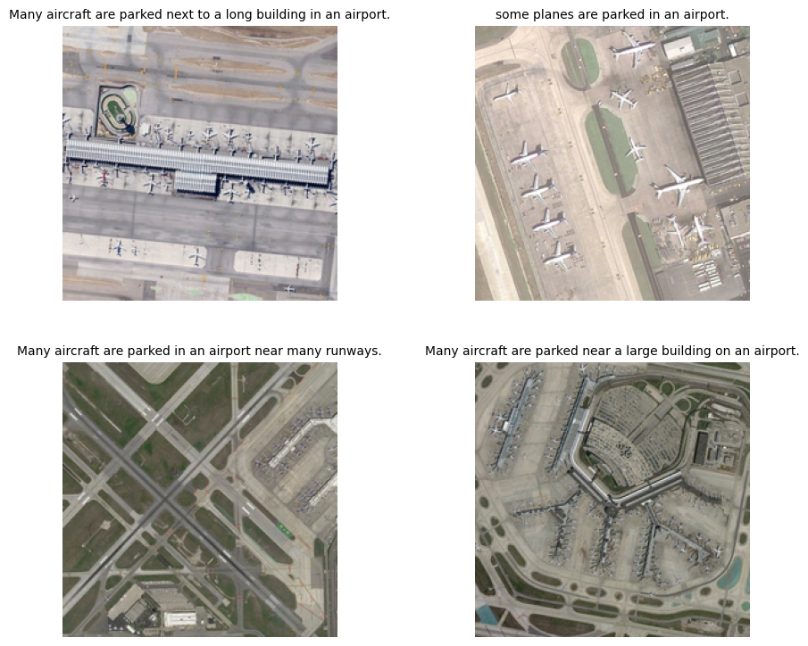
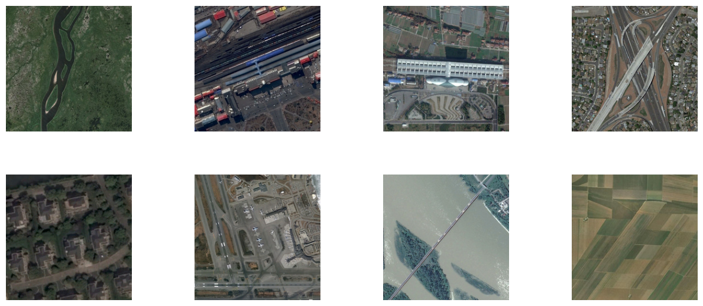

### Finetuning clip.

this is the journal of me following clipfinetune


```python
import os
import datasets
from dataclasses import dataclass, field
from typing import Optional
import matplotlib.pyplot as plt
import requests
import random
import numpy as np
import torch
from datasets import load_dataset
from PIL import Image
from torchvision.io import ImageReadMode, read_image
from torchvision.transforms import CenterCrop, ConvertImageDtype, Normalize, Resize
from torchvision.transforms.functional import InterpolationMode
from pdb import set_trace

import transformers
from transformers import (
    VisionTextDualEncoderProcessor,
    VisionTextDualEncoderModel,
    AutoImageProcessor,
    AutoModel,
    AutoTokenizer,
    HfArgumentParser,
    Trainer,
    TrainingArguments,
    set_seed,
)
from transformers.trainer_utils import get_last_checkpoint
from transformers.utils import check_min_version, send_example_telemetry
from transformers.utils.versions import require_version

import warnings
warnings.filterwarnings('ignore', category=UserWarning, module='torchvision')

# Will error if the minimal version of Transformers is not installed. Remove at your own risks.
check_min_version("4.31.0.dev0")
require_version("datasets>=1.8.0", "To fix: pip install -r examples/pytorch/contrastive-image-text/requirements.txt")
```

    c:\Users\kevol\anaconda3\envs\pytorch\lib\site-packages\tqdm\auto.py:21: TqdmWarning: IProgress not found. Please update jupyter and ipywidgets. See https://ipywidgets.readthedocs.io/en/stable/user_install.html
      from .autonotebook import tqdm as notebook_tqdm


Image Encoder for our CLIP is clip-vit-base-patch32 and Text Encoder is roberta-base


```python
model = VisionTextDualEncoderModel.from_vision_text_pretrained(
    "openai/clip-vit-base-patch32", "roberta-base"
)

tokenizer = AutoTokenizer.from_pretrained("roberta-base")
image_processor = AutoImageProcessor.from_pretrained("openai/clip-vit-base-patch32")
processor = VisionTextDualEncoderProcessor(image_processor, tokenizer)

model.save_pretrained("clip-roberta")
processor.save_pretrained("clip-roberta")
```

    config.json: 100%|██████████| 4.19k/4.19k [00:00<00:00, 1.18MB/s]
    c:\Users\kevol\anaconda3\envs\pytorch\lib\site-packages\huggingface_hub\file_download.py:149: UserWarning: `huggingface_hub` cache-system uses symlinks by default to efficiently store duplicated files but your machine does not support them in C:\Users\kevol\.cache\huggingface\hub\models--openai--clip-vit-base-patch32. Caching files will still work but in a degraded version that might require more space on your disk. This warning can be disabled by setting the `HF_HUB_DISABLE_SYMLINKS_WARNING` environment variable. For more details, see https://huggingface.co/docs/huggingface_hub/how-to-cache#limitations.
    To support symlinks on Windows, you either need to activate Developer Mode or to run Python as an administrator. In order to see activate developer mode, see this article: https://docs.microsoft.com/en-us/windows/apps/get-started/enable-your-device-for-development
      warnings.warn(message)
    pytorch_model.bin: 100%|██████████| 605M/605M [00:20<00:00, 29.5MB/s] 
    config.json: 100%|██████████| 481/481 [00:00<00:00, 41.7kB/s]
    c:\Users\kevol\anaconda3\envs\pytorch\lib\site-packages\huggingface_hub\file_download.py:149: UserWarning: `huggingface_hub` cache-system uses symlinks by default to efficiently store duplicated files but your machine does not support them in C:\Users\kevol\.cache\huggingface\hub\models--roberta-base. Caching files will still work but in a degraded version that might require more space on your disk. This warning can be disabled by setting the `HF_HUB_DISABLE_SYMLINKS_WARNING` environment variable. For more details, see https://huggingface.co/docs/huggingface_hub/how-to-cache#limitations.
    To support symlinks on Windows, you either need to activate Developer Mode or to run Python as an administrator. In order to see activate developer mode, see this article: https://docs.microsoft.com/en-us/windows/apps/get-started/enable-your-device-for-development
      warnings.warn(message)
    model.safetensors: 100%|██████████| 499M/499M [00:16<00:00, 30.0MB/s] 
    Some weights of RobertaModel were not initialized from the model checkpoint at roberta-base and are newly initialized: ['roberta.pooler.dense.bias', 'roberta.pooler.dense.weight']
    You should probably TRAIN this model on a down-stream task to be able to use it for predictions and inference.
    The projection layer and logit scale weights `['visual_projection.weight', 'text_projection.weight', 'logit_scale']` are newly initialized. You should probably TRAIN this model on a down-stream task to be able to use it for predictions and inference.
    vocab.json: 100%|██████████| 899k/899k [00:00<00:00, 2.38MB/s]
    merges.txt: 100%|██████████| 456k/456k [00:00<00:00, 1.84MB/s]
    tokenizer.json: 100%|██████████| 1.36M/1.36M [00:00<00:00, 10.6MB/s]
    preprocessor_config.json: 100%|██████████| 316/316 [00:00<00:00, 100kB/s]
    Could not find image processor class in the image processor config or the model config. Loading based on pattern matching with the model's feature extractor configuration.


We define two argument classes: ModelArguments and HfArgumentParser. This allows us to utilize Hugging Face’s HfArgumentParser in conjunction with the default TrainingArguments from Hugging Face.


```python
@dataclass
class ModelArguments:
    """
    Arguments pertaining to which model/config/tokenizer we are going to fine-tune, or train from scratch.
    """

    model_name_or_path: str = field(
        metadata={"help": "Path to pretrained model or model identifier from huggingface.co/models"},
    )
    config_name: Optional[str] = field(
        default=None, metadata={"help": "Pretrained config name or path if not the same as model_name"}
    )
    tokenizer_name: Optional[str] = field(
        default=None, metadata={"help": "Pretrained tokenizer name or path if not the same as model_name"}
    )
    image_processor_name: str = field(default=None, metadata={"help": "Name or path of preprocessor config."})
    cache_dir: Optional[str] = field(
        default=None, metadata={"help": "Where do you want to store the pretrained models downloaded from s3"}
    )
    model_revision: str = field(
        default="main",
        metadata={"help": "The specific model version to use (can be a branch name, tag name or commit id)."},
    )
    use_fast_tokenizer: bool = field(
        default=True,
        metadata={"help": "Whether to use one of the fast tokenizer (backed by the tokenizers library) or not."},
    )
    use_auth_token: bool = field(
        default=False,
        metadata={
            "help": (
                "Will use the token generated when running `huggingface-cli login` (necessary to use this script "
                "with private models)."
            )
        },
    )
```


```python
@dataclass
class DataTrainingArguments:
    """
    Arguments pertaining to what data we are going to input our model for training and eval.
    """
    dataset_name: Optional[str] = field(
        default=None, metadata={"help": "The name of the dataset to use (via the datasets library)."}
    )
    data_dir: Optional[str] = field(default=None, metadata={"help": "The data directory containing input files."})
    image_column: Optional[str] = field(
        default="image_path",
        metadata={"help": "The name of the column in the datasets containing the full image file paths."},
    )
    caption_column: Optional[str] = field(
        default="caption",
        metadata={"help": "The name of the column in the datasets containing the image captions."},
    )
    max_seq_length: Optional[int] = field(
        default=128,
        metadata={
            "help": (
                "The maximum total input sequence length after tokenization. Sequences longer "
                "than this will be truncated, sequences shorter will be padded."
            )
        },
    )
    overwrite_cache: bool = field(
        default=False, metadata={"help": "Overwrite the cached training and evaluation sets"}
    )
    preprocessing_num_workers: Optional[int] = field(
        default=None,
        metadata={"help": "The number of processes to use for the preprocessing."},
    )
```


```python
args_dict = {'output_dir': './clip-roberta-finetuned',
 'model_name_or_path': './clip-roberta',
 'data_dir': './data',
 'dataset_name': 'arampacha/rsicd',
 'image_column': 'image',
 'caption_column': 'captions',
 'remove_unused_columns': False,
 'per_device_train_batch_size': 64,
 'per_device_eval_batch_size': 64,
 'learning_rate': 5e-05,
 'warmup_steps': 0,
 'weight_decay': 0.1,
 'overwrite_output_dir': True,
 'push_to_hub': False}

parser = HfArgumentParser((ModelArguments, DataTrainingArguments, TrainingArguments))
model_args, data_args, training_args = parser.parse_dict(args_dict)
```


```python
# Dataset
class Transform(torch.nn.Module):
    def __init__(self, image_size, mean, std):
        super().__init__()
        self.transforms = torch.nn.Sequential(
            Resize([image_size], interpolation=InterpolationMode.BICUBIC, antialias=True),
            CenterCrop(image_size),
            ConvertImageDtype(torch.float),
            Normalize(mean, std),
        )
    def forward(self, x) -> torch.Tensor:
        """`x` should be an instance of `PIL.Image.Image`"""
        with torch.no_grad():
            x = self.transforms(x)
        return x
```


```python
def collate_fn(examples):
    pixel_values = torch.stack([example["pixel_values"] for example in examples])
    input_ids = torch.tensor([example["input_ids"] for example in examples], dtype=torch.long)
    attention_mask = torch.tensor([example["attention_mask"] for example in examples], dtype=torch.long)
    return {
        "pixel_values": pixel_values,
        "input_ids": input_ids,
        "attention_mask": attention_mask,
        "return_loss": True,
    }
```


```python
dataset = datasets.load_dataset("arampacha/rsicd")
```

    Downloading metadata: 100%|██████████| 1.03k/1.03k [00:00<?, ?B/s]
    Downloading data: 100%|██████████| 419M/419M [01:28<00:00, 4.73MB/s]
    Downloading data: 100%|██████████| 55.1M/55.1M [00:10<00:00, 5.43MB/s]
    Downloading data: 100%|██████████| 51.6M/51.6M [00:09<00:00, 5.18MB/s]
    Downloading data files: 100%|██████████| 3/3 [01:48<00:00, 36.25s/it]
    Extracting data files: 100%|██████████| 3/3 [00:00<00:00, 117.53it/s]
    Generating train split: 100%|██████████| 8734/8734 [00:02<00:00, 3624.40 examples/s]
    Generating test split: 100%|██████████| 1093/1093 [00:00<00:00, 3410.02 examples/s]
    Generating valid split: 100%|██████████| 1094/1094 [00:00<00:00, 4414.00 examples/s]


```python
dataset
```


    DatasetDict({
        train: Dataset({
            features: ['filename', 'captions', 'image'],
            num_rows: 8734
        })
        test: Dataset({
            features: ['filename', 'captions', 'image'],
            num_rows: 1093
        })
        valid: Dataset({
            features: ['filename', 'captions', 'image'],
            num_rows: 1094
        })
    })


```python
# Seeing an example
def show_images(dset, num_images=8, without_caption=True,num_columns=2,img_size=(4, 4)):
    num_rows = -(-num_images // num_columns)  # Ceiling division
    fig = plt.figure(figsize=(img_size[0] * num_columns, img_size[1] * num_rows))

    _list = list(range(len(dset)))
    for i in range(num_images):
        index = _list[i]
        ax = fig.add_subplot(num_rows, num_columns, i+1)
        image = dset[index]['image']
        plt.imshow(image)
        
        # Set title as the first caption
        if without_caption:
            caption = dset[index]['captions'][0]
            ax.set_title(caption, fontsize=10)
        
        # Remove axis
        plt.axis('off')
    plt.tight_layout()
    plt.subplots_adjust(wspace=0.5, hspace=0.01)  # Adjust these values as needed

    plt.show()
```


```python
show_images(dataset['train'], num_images=4, without_caption=True)
```


    

    


```python
tokenizer = AutoTokenizer.from_pretrained(
    model_args.model_name_or_path, cache_dir=model_args.cache_dir, use_fast=model_args.use_fast_tokenizer
)
```


```python
image_processor = AutoImageProcessor.from_pretrained(
    model_args.image_processor_name or model_args.model_name_or_path,
    cache_dir=model_args.cache_dir,
    revision=model_args.model_revision,
    use_auth_token=True if model_args.use_auth_token else None,
)

model = AutoModel.from_pretrained(
    model_args.model_name_or_path,
    cache_dir=model_args.cache_dir,
    revision=model_args.model_revision,
    use_auth_token=True if model_args.use_auth_token else None,
)
config = model.config
```


```python
set_seed(training_args.seed)
```


```python
image_transformations = Transform(
    config.vision_config.image_size, image_processor.image_mean, image_processor.image_std
)
image_transformations = torch.jit.script(image_transformations)
```


```python
def tokenize_captions(examples):
    captions = [example[0] for example in examples[data_args.caption_column]]
    text_inputs = tokenizer(captions, max_length=data_args.max_seq_length, padding="max_length", truncation=True)
    examples["input_ids"] = text_inputs.input_ids
    examples["attention_mask"] = text_inputs.attention_mask
    return examples

def transform_images(examples):
    images = [torch.tensor(np.array(image)).permute(2, 0, 1) for image in examples[data_args.image_column]]
    examples["pixel_values"] = [image_transformations(image) for image in images]
    return examples

def filter_corrupt_images(examples):
    """remove problematic images"""
    valid_images = []
    for image_file in examples[data_args.image_column]:
        try:
            Image.open(image_file)
            valid_images.append(True)
        except Exception:
            valid_images.append(False)
    return valid_images
```


```python
train_dataset = dataset["train"]
train_dataset = train_dataset.map(
    function=tokenize_captions,
    batched=True,
    num_proc=data_args.preprocessing_num_workers,
    load_from_cache_file=not data_args.overwrite_cache,
    desc="Running tokenizer on train dataset",
)
train_dataset.set_transform(transform_images)
```

    Running tokenizer on train dataset: 100%|██████████| 8734/8734 [00:01<00:00, 6126.48 examples/s]
    Parameter 'transform'=<function transform_images at 0x0000019A476F09D0> of the transform datasets.arrow_dataset.Dataset.set_format couldn't be hashed properly, a random hash was used instead. Make sure your transforms and parameters are serializable with pickle or dill for the dataset fingerprinting and caching to work. If you reuse this transform, the caching mechanism will consider it to be different from the previous calls and recompute everything. This warning is only showed once. Subsequent hashing failures won't be showed.


```python
train_dataset
```


    Dataset({
        features: ['filename', 'captions', 'image', 'input_ids', 'attention_mask'],
        num_rows: 8734
    })


```python
eval_dataset = dataset["valid"]
eval_dataset = eval_dataset.map(
    function=tokenize_captions,
    batched=True,
    num_proc=data_args.preprocessing_num_workers,
    load_from_cache_file=not data_args.overwrite_cache,
    desc="Running tokenizer on validation dataset",
)
eval_dataset.set_transform(transform_images)
```

    Running tokenizer on validation dataset: 100%|██████████| 1094/1094 [00:00<00:00, 3151.84 examples/s]


```python
train_dataset, eval_dataset
```


    (Dataset({
         features: ['filename', 'captions', 'image', 'input_ids', 'attention_mask'],
         num_rows: 8734
     }),
     Dataset({
         features: ['filename', 'captions', 'image', 'input_ids', 'attention_mask'],
         num_rows: 1094
     }))


```python
processor =  VisionTextDualEncoderProcessor(image_processor, tokenizer)
```


```python
# example from hugging face
urls = [
    "http://images.cocodataset.org/val2017/000000039769.jpg",
    "https://farm3.staticflickr.com/2674/5850229113_4fe05d5265_z.jpg",
]
images = [Image.open(requests.get(url, stream=True).raw) for url in urls]
inputs = processor(
    text=["a photo of a cat"], images=images, return_tensors="pt", padding=True
)
inputs['input_ids'] = inputs['input_ids'].cuda()
inputs['attention_mask'] = inputs['attention_mask'].cuda()
inputs['pixel_values'] = inputs['pixel_values'].cuda()
model = model.cuda()
outputs = model(**inputs)
logits_per_image = outputs.logits_per_image 
```


```python
logits_per_image
```


    tensor([[-0.4522],
            [ 0.7341]], device='cuda:0', grad_fn=<PermuteBackward0>)


```python
images[0]
```


    

    


```python
images[1]
```


    

    


```python
# base model prediction
np.random.seed(0)
indices = np.random.choice(len(dataset['valid']), 8, replace=False)
patches = dataset['valid'].select(indices.tolist())
```


```python
show_images(patches, 8, without_caption=False, num_columns=4,img_size=(3, 3))
```


    

    


```python
def show_result(model, patches, text, top_n = 3):
    images = [patch['image'] for patch in patches]
    inputs = processor(text=[text], images=images, return_tensors="pt", padding=True)
    inputs['input_ids'] = inputs['input_ids'].cuda()
    inputs['attention_mask'] = inputs['attention_mask'].cuda()
    inputs['pixel_values'] = inputs['pixel_values'].cuda()
    
    model = model.cuda()
    outputs = model(**inputs)
    logits_per_image = outputs.logits_per_image
    sorted_idx = (torch.sort(logits_per_image, dim=0, descending=True)[1][:,0]).tolist()
    sorted_idx = sorted_idx[:top_n]
    patches_sorted = patches.select(sorted_idx)
    show_images(patches_sorted, num_images=len(patches_sorted), without_caption=False, num_columns=1, img_size=(3,3))
```


```python
show_result(model, patches, 'more than one plane')
```


    

    


This was my first time training using HF trainer, feels a little overwhelming but I feel like If i do more and more after I get a good gpu, it will be easier than normal finetuning


```python
# 8. Initalize our trainer
trainer = Trainer(
    model=model,
    args=training_args,
    train_dataset=train_dataset,
    eval_dataset=eval_dataset,
    data_collator=collate_fn,
)

# 9. Training
train_result = trainer.train()
trainer.log_metrics("train", train_result.metrics)
metrics = trainer.evaluate()
trainer.log_metrics("eval", metrics)
```

      0%|          | 0/411 [00:00<?, ?it/s]c:\Users\kevol\anaconda3\envs\pytorch\lib\site-packages\torch\nn\modules\module.py:1501: UserWarning: operator () profile_node %376 : int = prim::profile_ivalue(%out_dtype.1)
     does not have profile information (Triggered internally at C:\cb\pytorch_1000000000000\work\third_party\nvfuser\csrc\graph_fuser.cpp:108.)
      return forward_call(*args, **kwargs)
    100%|██████████| 411/411 [1:19:45<00:00, 11.64s/it]


    {'train_runtime': 4785.2548, 'train_samples_per_second': 5.476, 'train_steps_per_second': 0.086, 'train_loss': 1.8650288454227495, 'epoch': 3.0}
    ***** train metrics *****
      epoch                    =        3.0
      train_loss               =      1.865
      train_runtime            = 1:19:45.25
      train_samples_per_second =      5.476
      train_steps_per_second   =      0.086


    100%|██████████| 18/18 [00:20<00:00,  1.16s/it]

    ***** eval metrics *****
      epoch                   =        3.0
      eval_loss               =     3.8813
      eval_runtime            = 0:00:22.34
      eval_samples_per_second =     48.959
      eval_steps_per_second   =      0.806


    


```python
show_result(model, patches, 'green trees')
```


    

    


```python
show_result(model, patches, 'airplane')
```


    

    


Honestly not the best but I also didn't train for long, the result or numbers aren't the important part here but rather I wanted to focus on how I can finetune
